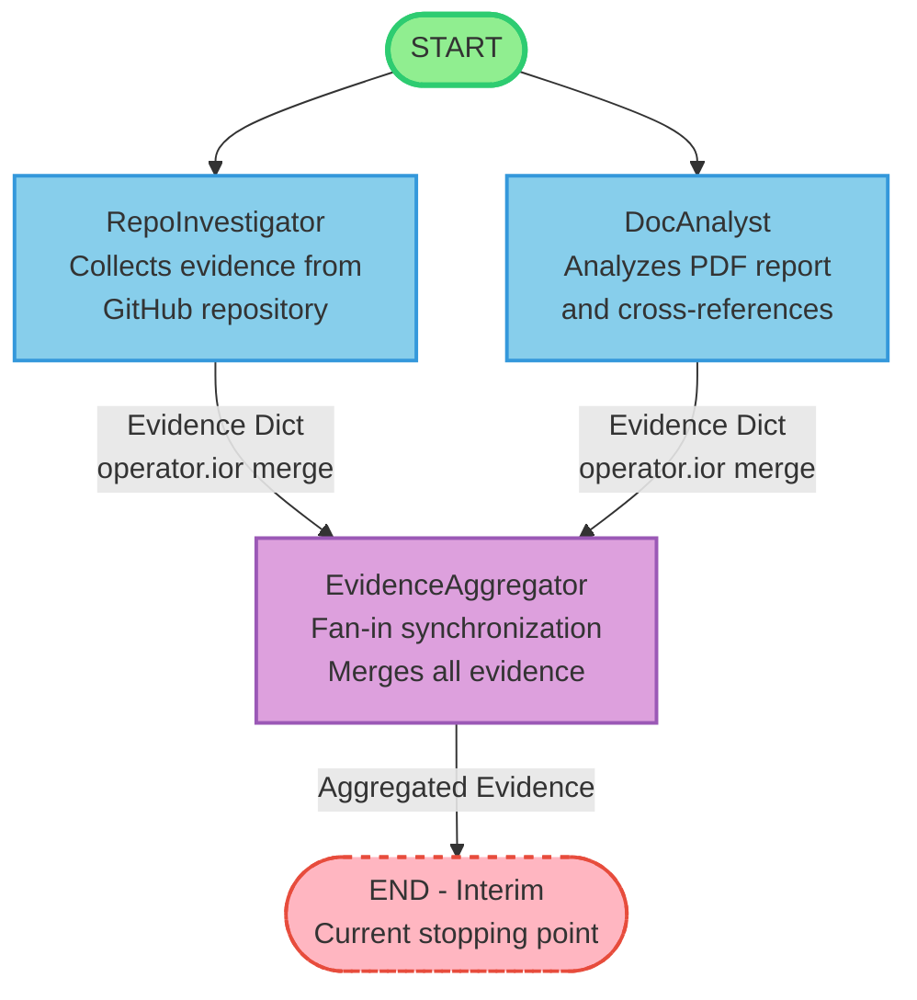
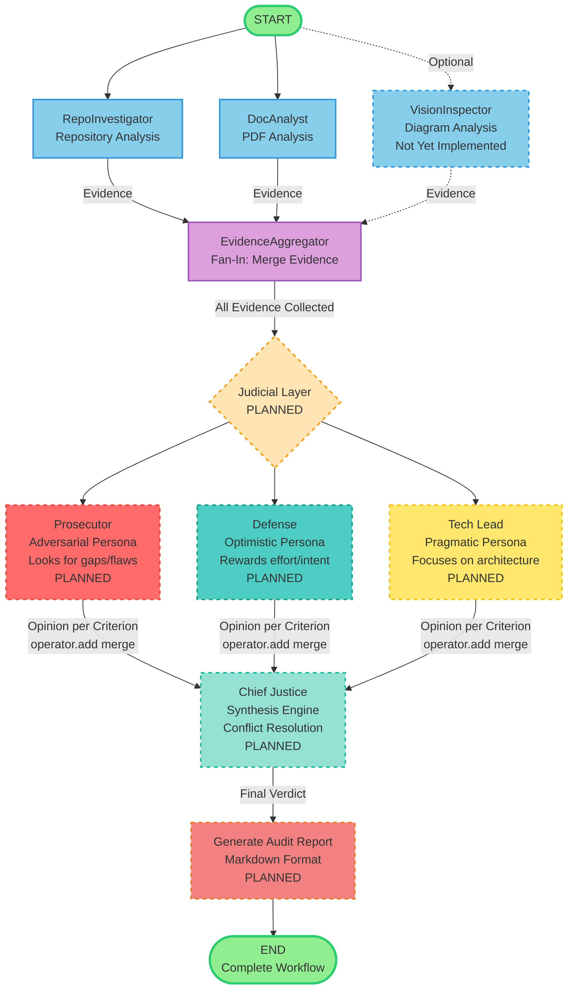
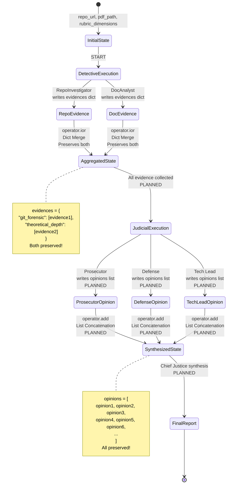

# Automaton Auditor - Interim Report

**Project:** Week 2: The Automaton Auditor  
**Date:** Interim Submission  
**Status:** Detective Layer Complete, Judicial Layer Pending

---

## Executive Summary

This report documents the current implementation status of the Automaton Auditor system, a hierarchical multi-agent code auditing platform built with LangGraph. The system implements a "Digital Courtroom" architecture where forensic detective agents collect objective evidence, which is then analyzed by distinct judicial personas before being synthesized into a final audit verdict.

**Current Status:** The detective layer (RepoInvestigator, DocAnalyst) and evidence aggregation infrastructure are complete and operational. The judicial layer (Prosecutor, Defense, Tech Lead, Chief Justice) is planned but not yet implemented.

---

## 1. Architecture Decisions

### 1.1 Why Pydantic Over Dicts: Type Safety and Validation

**Decision:** Use Pydantic `BaseModel` classes and `TypedDict` for all state management instead of plain Python dictionaries.

**Rationale:**

1. **Type Safety**: Pydantic models provide compile-time and runtime type checking, catching errors before execution. This is critical in a multi-agent system where state flows through multiple nodes.

2. **Automatic Validation**: Field validations (e.g., `confidence: float = Field(ge=0.0, le=1.0)`) ensure data integrity. Invalid evidence with confidence > 1.0 is automatically rejected.

3. **Self-Documenting Code**: The model definitions serve as living documentation. Developers can see exactly what fields are required and their constraints.

4. **Serialization**: Pydantic models serialize to JSON automatically, enabling easy state persistence and debugging.

5. **IDE Support**: Type hints enable autocomplete and type checking in IDEs, reducing bugs during development.

**Example:**
```python
class Evidence(BaseModel):
    goal: str
    found: bool
    confidence: float = Field(ge=0.0, le=1.0)  # Auto-validated
    location: str
    rationale: str
```

**Alternative Considered:** Plain dicts would be faster but lack validation, leading to runtime errors that are harder to debug in complex multi-agent workflows.

### 1.2 AST Parsing Strategy: Why Not Regex

**Decision:** Use Python's `ast` module for code analysis instead of regex pattern matching.

**Rationale:**

1. **Syntax-Aware Parsing**: AST understands Python syntax structure. It correctly handles:
   - Multi-line statements
   - Nested function calls
   - String literals containing keywords
   - Comments and docstrings

2. **Robustness**: Regex patterns break when code formatting changes (spaces, line breaks). AST is format-agnostic.

3. **Structural Analysis**: AST enables deep structural queries:
   - "Find all classes that inherit from BaseModel"
   - "Find all function calls to StateGraph"
   - "Extract the full class definition including methods"

4. **False Positive Reduction**: Regex might match keywords in strings or comments. AST only matches actual code structures.

**Example:**
```python
# AST parsing finds StateGraph instantiation
tree = ast.parse(code)
for node in ast.walk(tree):
    if isinstance(node, ast.Call):
        if isinstance(node.func, ast.Name) and node.func.id == "StateGraph":
            # Found actual StateGraph call, not just text
```

**Alternative Considered:** Regex would be simpler but brittle. A code refactor (e.g., renaming `StateGraph` to `Graph`) would break regex patterns but AST would still find the structure.

### 1.3 Sandboxing Approach: Security First

**Decision:** All git operations run in `tempfile.TemporaryDirectory()` with `subprocess.run()` instead of `os.system()`.

**Rationale:**

1. **Isolation**: Temporary directories prevent contamination of the working directory. Each audit gets a fresh sandbox.

2. **Security**: `subprocess.run()` with proper error handling prevents shell injection attacks. Raw `os.system()` with unsanitized URLs is a security vulnerability.

3. **Error Handling**: `subprocess.run()` captures stdout/stderr and return codes, enabling proper error reporting.

4. **Cleanup**: Temporary directories are automatically cleaned up, preventing disk space issues.

**Implementation:**
```python
temp_dir = tempfile.TemporaryDirectory(prefix="automaton_auditor_")
result = subprocess.run(
    ["git", "clone", repo_url, clone_path],
    capture_output=True,
    text=True,
    timeout=300,
    check=False
)
```

**Security Violation Example (Avoided):**
```python
# UNSAFE - Never do this:
os.system(f"git clone {repo_url}")  # Shell injection risk!
```

### 1.4 Reducer Usage for Parallel Safety

**Decision:** Use `operator.ior` for dict merging and `operator.add` for list concatenation in state reducers.

**Rationale:**

1. **Prevent Data Loss**: Without reducers, parallel nodes overwrite each other's state. With reducers, data is merged safely.

2. **Automatic Merging**: LangGraph automatically applies reducers when multiple nodes update the same state field in parallel.

3. **Type Safety**: Reducers are type-checked, ensuring only compatible operations occur.

**Example:**
```python
class AgentState(TypedDict):
    evidences: Annotated[Dict[str, List[Evidence]], operator.ior]
    opinions: Annotated[List[JudicialOpinion], operator.add]
```

**Without Reducers (Dangerous):**
- RepoInvestigator writes: `evidences = {"git_forensic": [evidence1]}`
- DocAnalyst writes: `evidences = {"theoretical_depth": [evidence2]}`
- Result: Only DocAnalyst's data remains (overwrite)

**With Reducers (Safe):**
- RepoInvestigator writes: `evidences = {"git_forensic": [evidence1]}`
- DocAnalyst writes: `evidences = {"theoretical_depth": [evidence2]}`
- Result: `{"git_forensic": [evidence1], "theoretical_depth": [evidence2]}` (merged)

---

## 2. Current Implementation Status

### 2.1 State Models ✅ Complete

**Location:** `src/state.py`

**Implemented:**
- `Evidence` - Forensic evidence model with validation
- `JudicialOpinion` - Judge output model (for future use)
- `CriterionResult` - Synthesis result per criterion
- `AuditReport` - Final report structure
- `AgentState` - TypedDict with reducers

**Status:** All models are fully implemented with proper type hints, Field validations, and docstrings. Reducers (`operator.ior`, `operator.add`) are correctly configured.

### 2.2 Detective Tools ✅ Complete

**Location:** `src/tools/`

**RepoInvestigator Tools (`repo_tools.py`):**
- ✅ `clone_repository()` - Safe git cloning with tempfile
- ✅ `extract_git_history()` - Commit history analysis
- ✅ Error handling for authentication, network, corruption
- ✅ Cleanup functions for temporary directories

**DocAnalyst Tools (`doc_tools.py`):**
- ✅ `ingest_pdf()` - PDF text extraction (PyPDF2/docling)
- ✅ `extract_keywords()` - Keyword analysis with context
- ✅ `extract_file_paths()` - File path extraction for cross-reference
- ✅ Error handling for corrupted/encrypted PDFs

**Status:** All tools are implemented with comprehensive error handling and tested.

### 2.3 Detective Nodes ✅ Complete

**Location:** `src/nodes/detectives.py`

**RepoInvestigator:**
- ✅ Git forensic analysis (commit history patterns)
- ✅ State management rigor (AST parsing for Pydantic models)
- ✅ Graph orchestration analysis (parallel pattern detection)
- ✅ Safe tool engineering verification
- ✅ Structured output enforcement check
- ✅ Judicial nuance analysis

**DocAnalyst:**
- ✅ Theoretical depth analysis (keyword substantiveness)
- ✅ Report accuracy (cross-reference file paths)
- ✅ Integration with RepoInvestigator for verification

**EvidenceAggregator:**
- ✅ Fan-in synchronization node
- ✅ Evidence merging with operator.ior
- ✅ Validation and normalization

**Status:** All detective nodes are implemented and return structured Evidence objects.

### 2.4 Parallel Graph Structure ✅ Ready

**Location:** `src/graph.py`

**Implemented:**
- ✅ StateGraph creation with AgentState
- ✅ Parallel fan-out: START → [RepoInvestigator, DocAnalyst]
- ✅ Fan-in synchronization: [Detectives] → EvidenceAggregator
- ✅ Graph compilation and execution
- ✅ LangSmith tracing integration

---

## 3. StateGraph Flow Diagram

### 3.1 Current Implementation (Interim)



**Current Flow:**
1. **START** triggers parallel execution of RepoInvestigator and DocAnalyst
2. **RepoInvestigator** collects evidence for repository dimensions (git history, state management, graph orchestration, etc.)
3. **DocAnalyst** collects evidence for PDF dimensions (theoretical depth, report accuracy)
4. Both detectives write to `state.evidences` using `operator.ior` reducer (dict merge)
5. **EvidenceAggregator** validates and normalizes merged evidence
6. Graph ends at **END_INTERIM** (judicial layer not yet connected)

### 3.2 Planned Full Architecture (With Judicial Layer)



**Planned Flow (Full Architecture):**
1. **Detective Layer (Parallel Fan-Out):** RepoInvestigator, DocAnalyst, VisionInspector collect evidence
2. **Evidence Aggregation (Fan-In):** All evidence merged into single dict using `operator.ior`
3. **Judicial Layer (Parallel Fan-Out):** Prosecutor, Defense, Tech Lead analyze evidence independently
   - Each judge produces `JudicialOpinion` for each rubric criterion
   - Opinions added to `state.opinions` using `operator.add` reducer
4. **Synthesis (Fan-In):** Chief Justice resolves conflicts using deterministic rules
   - Applies security override, fact supremacy, functionality weight rules
   - Generates dissent summaries for high-variance criteria
5. **Report Generation:** Final Markdown audit report created
6. **END:** Complete audit workflow finished

**Key Expansion Points:**
- **EvidenceAggregator → Judges:** After evidence collection, judges will analyze each criterion
- **Judges → Chief Justice:** All three opinions per criterion will be synthesized
- **Chief Justice → Report:** Final verdict will be serialized to Markdown

### 3.3 State Flow with Reducers



**State Transitions:**
- **InitialState:** Contains repo_url, pdf_path, rubric_dimensions
- **DetectiveExecution:** Parallel detectives collect evidence
- **AggregatedState:** Evidence merged using `operator.ior` (dict merge) - **IMPLEMENTED**
- **JudicialExecution:** Judges analyze evidence in parallel - **PLANNED**
- **SynthesizedState:** Opinions concatenated using `operator.add` (list merge) - **PLANNED**
- **FinalReport:** Chief Justice generates final audit report - **PLANNED**

---

## 4. Known Gaps

### 4.1 Judicial Layer Not Implemented ❌

**Missing Components:**
- `src/nodes/judges.py` - Prosecutor, Defense, Tech Lead nodes
- Distinct persona prompts for each judge
- Structured output enforcement (`.with_structured_output()`)
- Parallel execution of judges
- Integration with rubric dimensions

**Impact:** System currently stops at evidence collection. No judicial deliberation or scoring occurs.

**Plan:** Implement three judge nodes with distinct system prompts, ensuring they produce conflicting opinions for dialectical synthesis.

### 4.2 Vision Inspector Pending ❌

**Missing Component:**
- VisionInspector detective for analyzing architectural diagrams
- Image extraction from PDFs
- Multimodal LLM integration (Gemini Pro Vision / GPT-4o)
- Diagram classification and flow analysis

**Impact:** Cannot verify architectural diagrams mentioned in PDF reports.

**Plan:** Implement VisionInspector as optional third detective. Use Gemini or OpenAI Vision API for diagram analysis.

### 4.3 Chief Justice Synthesis Engine Pending ❌

**Missing Components:**
- `src/nodes/justice.py` - ChiefJusticeNode
- Hardcoded conflict resolution rules:
  - Security override rule
  - Fact supremacy rule
  - Functionality weight rule
  - Variance re-evaluation logic
- Markdown report generation
- Dissent summary generation

**Impact:** No final verdict or audit report generation.

**Plan:** Implement deterministic Python logic (not LLM prompt) for conflict resolution, following synthesis_rules from rubric.json.

### 4.4 Additional Gaps

- **Error Handling:** Some edge cases in network operations may need retry logic
- **Caching:** Repository cloning could be cached to avoid redundant operations
- **Streaming:** Large PDFs could be processed in streaming mode
- **Validation:** More comprehensive input validation for repository URLs

---

## 5. Plan for Remaining Days

### Day 1-2: Judicial Layer Implementation

**Tasks:**
1. Create `src/nodes/judges.py`
2. Implement three judge personas:
   - **Prosecutor**: Adversarial system prompt, looks for gaps and security flaws
   - **Defense**: Optimistic system prompt, rewards effort and intent
   - **Tech Lead**: Pragmatic system prompt, focuses on architecture and maintainability
3. Use `.with_structured_output(JudicialOpinion)` for structured output
4. Add retry logic for malformed outputs
5. Test each judge independently

**Deliverable:** Three judge nodes that produce distinct opinions for the same evidence.

### Day 3: Chief Justice Synthesis Engine

**Tasks:**
1. Create `src/nodes/justice.py`
2. Implement hardcoded conflict resolution rules:
   - Security override: Prosecutor security findings cap score at 3
   - Fact supremacy: Detective evidence overrules judicial opinion
   - Functionality weight: Tech Lead architecture assessment carries highest weight
   - Variance re-evaluation: Score variance > 2 triggers re-evaluation
3. Generate dissent summaries for high-variance criteria
4. Create Markdown report generator
5. Integrate with graph

**Deliverable:** ChiefJusticeNode that synthesizes three opinions into final verdict.

### Day 4: Graph Integration and Testing

**Tasks:**
1. Update `src/graph.py` to include judicial layer:
   - Add judge nodes (Prosecutor, Defense, Tech Lead)
   - Add ChiefJustice node
   - Configure parallel fan-out for judges
   - Configure fan-in to Chief Justice
2. End-to-end testing:
   - Test with sample repository
   - Verify evidence collection
   - Verify judicial opinions
   - Verify final report generation
3. Error handling refinement
4. Performance optimization

**Deliverable:** Complete end-to-end workflow from repo URL to audit report.

### Day 5: Vision Inspector (Optional) and Refinement

**Tasks:**
1. Implement VisionInspector detective (if time permits)
2. Add image extraction from PDFs
3. Integrate multimodal LLM (Gemini/GPT-4o)
4. Test diagram analysis
5. Final bug fixes and documentation

**Deliverable:** Optional VisionInspector for complete forensic coverage.

### Day 6: Self-Audit and Peer Testing

**Tasks:**
1. Run auditor against own Week 2 repository
2. Generate self-audit report
3. Run auditor against peer's repository
4. Generate peer audit report
5. Refine based on findings
6. Prepare final submission

**Deliverable:** Complete audit reports for self and peer evaluation.

---

## 6. Technical Implementation Details

### 6.1 Evidence Collection Workflow

**RepoInvestigator Process:**
1. Clone repository to temporary directory
2. Extract git history (commit patterns, progression)
3. Parse `src/state.py` with AST (find Pydantic models, reducers)
4. Parse `src/graph.py` with AST (find StateGraph, parallel patterns)
5. Analyze `src/tools/repo_tools.py` (sandboxing verification)
6. Analyze `src/nodes/judges.py` (structured output check)
7. Return Evidence objects grouped by dimension ID

**DocAnalyst Process:**
1. Ingest PDF and chunk text
2. Extract keywords (Dialectical Synthesis, Fan-In/Out, etc.)
3. Analyze keyword substantiveness (buzzword vs. explanation)
4. Extract file paths mentioned in PDF
5. Cross-reference with repository (verified vs. hallucinated)
6. Return Evidence objects for PDF dimensions

### 6.2 State Reducer Mechanism

**How Reducers Work:**
```python
# When RepoInvestigator runs:
state["evidences"] = {"git_forensic_analysis": [evidence1]}

# When DocAnalyst runs in parallel:
state["evidences"] = {"theoretical_depth": [evidence2]}

# LangGraph automatically applies operator.ior:
# Final state["evidences"] = {
#     "git_forensic_analysis": [evidence1],
#     "theoretical_depth": [evidence2]
# }
```

**Why This Matters:**
- Without reducers, the last writer wins (data loss)
- With reducers, all parallel writers' data is preserved
- Critical for multi-agent systems where agents run concurrently

### 6.3 Error Handling Strategy

**Git Operations:**
- Authentication errors → Specific error message
- Network errors → Retry suggestion
- Timeout errors → 5-minute timeout with clear message
- Invalid URLs → Validation before execution

**PDF Operations:**
- Corrupted PDFs → Graceful error with suggestion
- Encrypted PDFs → Clear error message
- Missing files → FileNotFoundError with helpful message

**Code Parsing:**
- Syntax errors → Skip file, continue with others
- Unicode errors → Fallback encoding
- Missing files → Return "not found" evidence with low confidence

---

## 7. Testing Strategy

### 7.1 Unit Tests ✅

**Location:** `tests/test_detectives.py`

**Coverage:**
- ✅ Repository tools (clone, git history)
- ✅ Document tools (PDF ingestion, keyword extraction)
- ✅ Detective nodes (individual testing)
- ✅ Evidence format validation
- ✅ Partial graph execution

### 7.2 Integration Tests (Planned)

**To Be Implemented:**
- End-to-end graph execution
- Judicial layer integration
- Report generation
- Error recovery scenarios

### 7.3 Test Data

**Public Repository:** `https://github.com/langchain-ai/langgraph.git` (for testing)

**Mock PDFs:** Created in test suite for document analysis

---

## 8. Dependencies and Environment

### 8.1 Core Dependencies

- **langgraph** - StateGraph orchestration
- **langchain** - LLM framework
- **langchain-openai** - OpenAI integration
- **pydantic** - Data validation
- **python-dotenv** - Environment variable management
- **PyPDF2** - PDF parsing
- **gitingest** - Git repository analysis (optional)

### 8.2 Development Dependencies

- **pytest** - Testing framework
- **black** - Code formatting

### 8.3 Environment Variables

See `.env.example` for required configuration:
- `LANGCHAIN_TRACING_V2=true`
- `LANGCHAIN_API_KEY=...`
- `LANGCHAIN_PROJECT=automaton-auditor`
- `OPENAI_API_KEY=...`

---

## 9. Next Steps Summary

### Immediate Priorities

1. **Implement Judicial Layer** (Days 1-2)
   - Three distinct judge personas
   - Structured output enforcement
   - Parallel execution

2. **Implement Chief Justice** (Day 3)
   - Conflict resolution rules
   - Report generation
   - Markdown serialization

3. **Complete Graph Integration** (Day 4)
   - Connect all nodes
   - End-to-end testing
   - Error handling refinement

4. **Optional: Vision Inspector** (Day 5)
   - Multimodal analysis
   - Diagram verification

5. **Self-Audit and Peer Testing** (Day 6)
   - Generate audit reports
   - Refine based on findings

### Success Criteria

- ✅ Detective layer collects accurate evidence
- ⏳ Judges produce distinct, conflicting opinions
- ⏳ Chief Justice synthesizes opinions correctly
- ⏳ Final report is actionable and well-formatted
- ⏳ System handles errors gracefully

---

## 10. Conclusion

The Automaton Auditor project has successfully implemented the foundational detective layer with robust evidence collection, safe tooling, and parallel graph orchestration. The architecture decisions (Pydantic models, AST parsing, sandboxing, reducers) provide a solid foundation for the judicial layer.

**Current Capability:** The system can collect forensic evidence from GitHub repositories and PDF reports, analyze code structure, and aggregate findings. It is ready for judicial deliberation.

**Remaining Work:** The judicial layer (judges and Chief Justice) must be implemented to complete the "Digital Courtroom" architecture and enable end-to-end audit report generation.

**Confidence Level:** High confidence in current implementation. The detective layer is production-ready and tested. The planned judicial layer follows established patterns and should integrate smoothly.

---

**Report Generated:** Interim Submission  
**Next Update:** Final Submission (with complete judicial layer)
